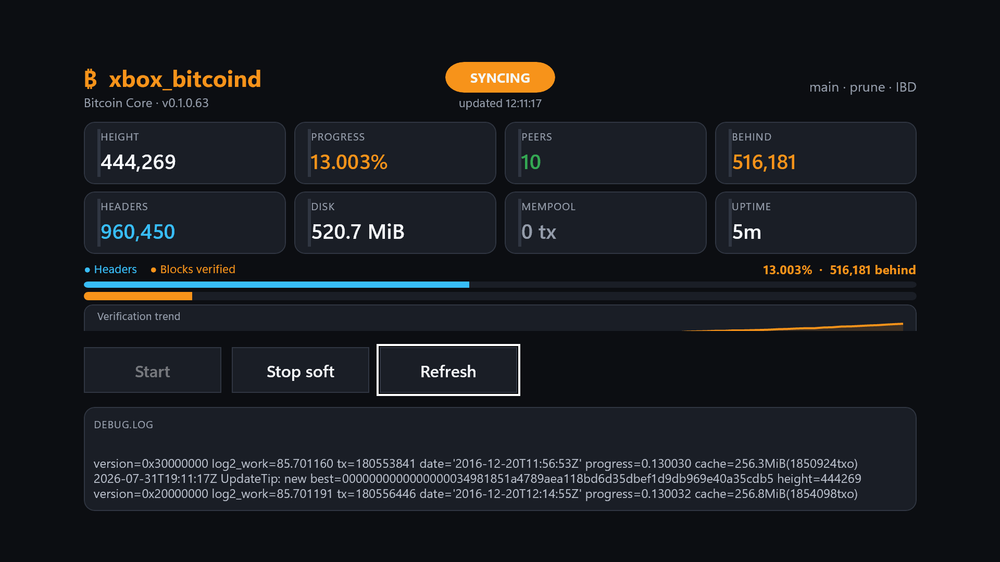

# xbox_bitcoind

Pruned **[Bitcoin Core](https://github.com/bitcoin/bitcoin) (`bitcoind`)** full node for
**Xbox Series S|X [Developer Mode](https://learn.microsoft.com/en-us/windows/uwp/xbox-apps/devkit-activation)**,
packaged as a **UWP Game** app and installed over Device Portal.

> **Dev Mode only** — not Microsoft Store, not retail Xbox. Not affiliated with Microsoft or Bitcoin Core.

Companion project on the same console: [xllama](https://github.com/gianlucamazza/xllama).

[](https://github.com/gianlucamazza/xbox_bitcoind/actions/workflows/ci-linux.yml)
[](https://github.com/gianlucamazza/xbox_bitcoind/actions/workflows/ci-msvc-baseline.yml)
[](https://github.com/gianlucamazza/xbox_bitcoind/actions/workflows/build-uwp.yml)
[](https://github.com/gianlucamazza/xbox_bitcoind/actions/workflows/release.yml)
[](https://github.com/gianlucamazza/xbox_bitcoind/releases/latest)
[](LICENSE)



_Live capture, Series S Dev Mode — mid-IBD dashboard (Core **v31.1** · app package). Ops: [docs/tracking.md](docs/tracking.md)._

## Features

- **Bitcoin Core v31.1** embedded in-process (`BitcoindMain` / `BITCOIND_EMBED`)
- Mainnet pruned node (`prune=550`, outbound P2P, local RPC)
- Controller-first **10-foot dashboard**: primary/secondary metrics, dual progress bars,
  session sparkline, rough **ETA**, tip age (`mediantime`), live log tail
- Status pills: `HEADERS` / `SYNCING` / `SYNCED` / `STALE` (ops consensus, not BIP9 signaling)
- Clear versioning: **Core pin** vs **app MSIX**; release packages stamp `X.Y.Z` from the tag (e.g. `Bitcoin Core v31.1 · app 0.1.5.10020`)
- **Soft-stop** on Home suspend + **auto-restart** on resume (continue IBD)
- Path-filtered CI + automated **GitHub Releases** on `v*` tags

|                  |                                                                                                                                            |
| ---------------- | ------------------------------------------------------------------------------------------------------------------------------------------ |
| Package identity | `GianlucaMazza.xboxbitcoind` · App Id `App` · type **Game**                                                                                |
| Latest release   | **[v0.1.5](https://github.com/gianlucamazza/xbox_bitcoind/releases/tag/v0.1.5)** (MSIX `0.1.5.10020` · `SHA256SUMS` + provenance attached) |
| Live console     | `./scripts/node-status.sh` · [docs/tracking.md](docs/tracking.md)                                                                          |
| Datadir          | `LocalState\bitcoin`                                                                                                                       |
| Core pin         | [config/bitcoin-core.pin](config/bitcoin-core.pin) (**v31.1**)                                                                             |

## Sync benchmarks (measured)

Field numbers from a **Xbox Series S** Dev Mode install (Game class), mainnet, Bitcoin Core **v31.1**, package defaults `prune=550` · `dbcache=512` · `maxconnections=16` · `blocksonly=1` · outbound-only. Keep the title **focused** (Home suspends IBD).

Prefer **progress rate** over raw blocks/h: early chain blocks are small; rate drops as blocks grow.

### Throughput (mid-IBD, ~2015-era tip)

| Window                                  | Height      | Progress    | Rate                                          | Source                         |
| --------------------------------------- | ----------- | ----------- | --------------------------------------------- | ------------------------------ |
| ~1 h continuous (`UpdateTip`)           | 327k → 370k | 3.6% → 5.8% | **~43k blocks/h** · **~2.2 pp progress/h**    | `debug.log` on **0.1.0.10017** |
| ~1.2 h host samples (post-wipe segment) | 191k → 346k | 0.4% → 4.4% | **~126k blocks/h** · **~3.3 pp progress/h**   | hourly `ibd.jsonl`             |
| Rough ETA from mid-IBD progress rate    | —           | @ ~6%       | **~40–45 h** wall-clock to tip _if rate held_ | optimistic; later years slower |

### Resources (while syncing)

| Metric              | Observed mid-IBD              | Notes                                                                       |
| ------------------- | ----------------------------- | --------------------------------------------------------------------------- |
| Working set         | **~0.7–1.1 GiB**              | Peak during active verification                                             |
| Core `cache=` line  | **~50–540 MiB**               | Cycles with flushes; conf `dbcache=512`                                     |
| Datadir (pruned)    | **~1.5–2.1 GiB** at ~5–6%     | Grows then prunes; shared Dev storage ~90 GB                                |
| Soft-stop (mid-IBD) | **~8 s** clean, tip conserved | Host `IsRunning`-aware stop; see [docs/persistence.md](docs/persistence.md) |

### Caveats

- Not a lab benchmark: home LAN, concurrent Dev apps (e.g. xllama) may reduce headroom.
- After datadir wipe / redeploy, wall-clock restarts; tip is conserved across **soft-stop** upgrades.
- Re-measure at tip with `./scripts/ibd-report.sh` and `./scripts/node-status.sh` — full results live in [docs/ops.md](docs/ops.md) and [docs/tracking.md](docs/tracking.md).

## Quick start

### Requirements

| Role        | Need                                                                                                                            |
| ----------- | ------------------------------------------------------------------------------------------------------------------------------- |
| Console     | Xbox Series S\|X in **Developer Mode**, free space on Dev storage (~90 GB typical)                                              |
| Host        | Linux or Windows, `curl`, `python3`, network path to Device Portal                                                              |
| Credentials | `~/.config/xllama/xbox-env` **or** copy [config/xbox-env.example](config/xbox-env.example) → `~/.config/xbox_bitcoind/xbox-env` |

### Install from Release

1. Download the **[latest release](https://github.com/gianlucamazza/xbox_bitcoind/releases/latest)**  
   (`xbox_bitcoind_*.msix` and `xbox_bitcoind-dev.cer`).
2. From the repo root on the host:

```bash
source scripts/env.sh   # resolves xllama or project xbox-env
./scripts/deploy.sh install-cert path/to/xbox_bitcoind-dev.cer
./scripts/deploy.sh path/to/xbox_bitcoind_*.msix
```

3. On the console: **Dev Home → package → View details → App type → Game**.
4. Start and check:

```bash
./scripts/deploy.sh start-app
./scripts/deploy.sh status
```

5. **Stop only** via soft stop (do not hard-kill during IBD):

```bash
./scripts/deploy.sh stop-app
```

Day-to-day operation: **[docs/ops.md](docs/ops.md)**.

## Build from source

| Target                    | Host                     | Command                                                                             |
| ------------------------- | ------------------------ | ----------------------------------------------------------------------------------- |
| Scaffold MSIX (no Core)   | Windows + UWP C++        | `.\scripts\build-uwp.ps1`                                                           |
| Core libs only            | **VS 2026 18.3+**, vcpkg | `.\scripts\build-uwp.ps1 -CoreOnly`                                                 |
| Product MSIX (reuse Core) | same                     | `.\scripts\build-uwp.ps1 -WithCore -SkipCoreBuild`                                  |
| Product MSIX (all-in-one) | same                     | `.\scripts\build-uwp.ps1 -WithCore`                                                 |
| Desktop pin baseline      | VS 2026                  | `.\scripts\build-msvc-baseline.ps1`                                                 |
| Linux pin smoke           | Linux                    | `./scripts/fetch-bitcoin-core.sh && CI_SKIP_TESTS=1 ./scripts/build-linux-smoke.sh` |

Fetch the pin first on Windows with `.\scripts\fetch-bitcoin-core.ps1`.

More detail: [docs/uwp-scaffold.md](docs/uwp-scaffold.md) · [docs/ci.md](docs/ci.md) · [scripts/README.md](scripts/README.md).

## Architecture

```
xbox_bitcoind.exe (UWP AppContainer, Game class — more RAM/CPU, not anti-suspend)
├── App — OnSuspending soft-stop · OnResuming auto-restart if was running
├── MainPage — 10-foot ops dashboard (consensus health, not soft-fork signaling)
├── probes / rpc_client — AppContainer checks · loopback JSON-RPC + cookie
└── node_host → BitcoindMain(argc, argv)   [XBB_WITH_CORE]
        datadir = LocalState\bitcoin
        conf profiles: console (IBD) | tip (post-sync)
        static: bitcoin_embed + node stack + event.dll (x64-uwp)

Linux host ops plane
├── health-check / node-status / ibd-sample timer
├── deploy.sh (MSIX + VCLibs)
└── apply-console-conf --profile console|tip
```

In-process only (no `CreateProcess`). No Tor / mining / LN in this package.  
Patches: [patches/uwp/](patches/uwp/README.md). Full checklist: [docs/plan-core-uwp.md](docs/plan-core-uwp.md).  
Dashboard layout: [docs/ui.md](docs/ui.md).

## Project layout

```
config/       pin, bitcoin.conf.console, xbox-env.example
uwp/          C++/WinRT app
patches/uwp/  Core AppContainer + durability patches
scripts/      fetch, build, deploy, release
docs/         guides — [docs/README.md](docs/README.md)
.github/      CI + release automation
```

## Documentation

| Audience          | Start here                                     |
| ----------------- | ---------------------------------------------- |
| Run on console    | [docs/ops.md](docs/ops.md)                     |
| Doc index         | [docs/README.md](docs/README.md)               |
| Tracking / issues | [docs/tracking.md](docs/tracking.md)           |
| Architecture      | [docs/plan-core-uwp.md](docs/plan-core-uwp.md) |
| CI / releases     | [docs/ci.md](docs/ci.md)                       |
| Scripts           | [scripts/README.md](scripts/README.md)         |
| Contributing      | [CONTRIBUTING.md](CONTRIBUTING.md)             |
| Security          | [SECURITY.md](SECURITY.md)                     |
| Changelog         | [CHANGELOG.md](CHANGELOG.md)                   |

Research archive (phase 0): [docs/research/](docs/research/00-feasibility.md).

## Status

| Area                            | State                                                                                                                                                                                                                  |
| ------------------------------- | ---------------------------------------------------------------------------------------------------------------------------------------------------------------------------------------------------------------------- |
| **v1 engineering**              | **Complete** ([docs/roadmap.md](docs/roadmap.md))                                                                                                                                                                      |
| Architecture + UI               | **Complete** — lifecycle, host plane, tip age / HEADERS·STALE ([docs/plan-core-uwp.md](docs/plan-core-uwp.md) · [docs/ui.md](docs/ui.md))                                                                              |
| WithCore on Series S            | Working — console package **0.1.5.10020** (**v0.1.5**, deployed 2026-08-02); IBD mid-progress (~45.3%)                                                                                                                 |
| Soft-stop persistence           | Tip conserved early + mid IBD; clean mid-IBD soft-stop field-verified ([#4](https://github.com/gianlucamazza/xbox_bitcoind/issues/4) closed); tip retest [#3](https://github.com/gianlucamazza/xbox_bitcoind/issues/3) |
| Mainnet IBD → tip + 24h stable  | **Ops pending** (timer running; `./scripts/v1-close-check.sh`)                                                                                                                                                         |
| Wallet / Store / inbound listen | Out of scope for v1                                                                                                                                                                                                    |

Live checklist: [docs/tracking.md](docs/tracking.md).

## Releases (maintainers)

```bash
./scripts/cut-release.sh 0.2.0   # tag v0.2.0 → CI builds MSIX → GitHub Release
```

See [docs/ci.md § Releases](docs/ci.md#releases-automated).

## License

- This repository (app glue, scripts, docs): [MIT](LICENSE).
- [Bitcoin Core](https://github.com/bitcoin/bitcoin) is MIT; keep upstream notices when redistributing derived trees or patches.
- Third-party attribution: [NOTICE](NOTICE).

## Disclaimer

Dev Mode and console software are subject to Microsoft terms. Running a node is not
mining and does not earn block rewards. You are responsible for legal and network
usage in your jurisdiction.
